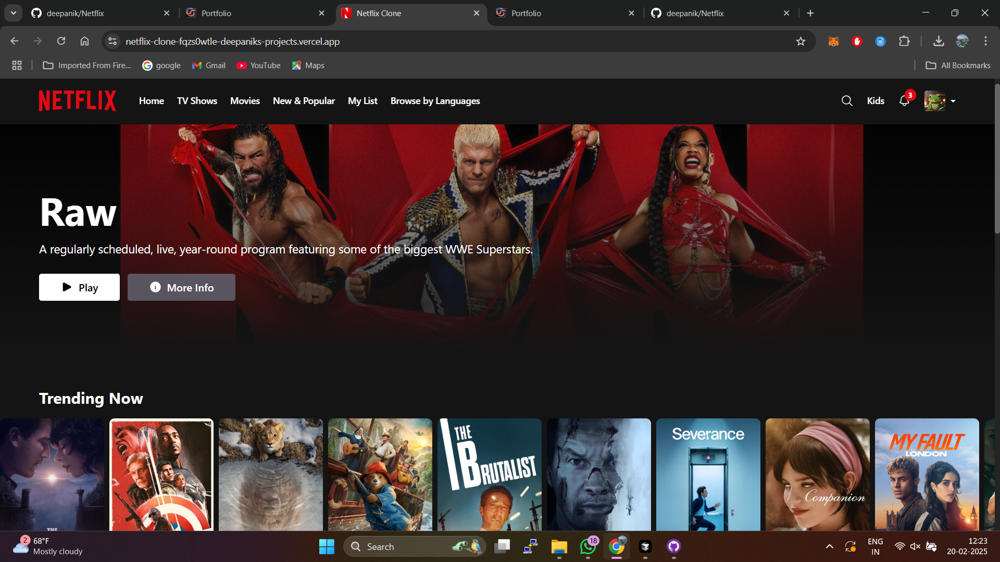

# 🎬 Netflix Clone

A modern, responsive Netflix clone built with React, TypeScript, and Vite. This project replicates the core features and sleek design of Netflix's streaming platform.



## ✨ Features

- 🎯 Pixel-perfect Netflix UI clone
- 📱 Fully responsive design (mobile, tablet, desktop)
- 🎥 Dynamic movie rows with smooth scrolling
- 🔄 Interactive hover effects and animations
- 🎬 Movie trailers and information modals
- 👤 Profile management interface
- 🔍 Search functionality
- 🌙 Dynamic navbar with scroll effect
- 🎨 Modern UI components

## 🛠️ Built With

- [React 18](https://reactjs.org/) - UI Library
- [TypeScript](https://www.typescriptlang.org/) - Type Safety
- [Vite](https://vitejs.dev/) - Build Tool
- [Tailwind CSS](https://tailwindcss.com/) - Styling
- [React Router](https://reactrouter.com/) - Navigation
- [Hero Icons](https://heroicons.com/) - Icons

## 🚀 Getting Started

### Prerequisites

- Node.js (version 14 or higher)
- npm or yarn

### Installation

1. Clone the repository
```bash
git clone https://github.com/deepanik/netflix.git
```

2. Install dependencies
```bash
cd netflix
npm install
```

3. Start the development server
```bash
npm run dev
```

4. Open [http://localhost:5173](http://localhost:5173) in your browser

## 📁 Project Structure

```
netflix-clone/
├── src/
│   ├── components/     # React components
│   ├── services/      # API services
│   ├── utils/         # Utility functions
│   ├── assets/        # Static assets
│   └── App.tsx        # Root component
├── public/            # Public assets
└── package.json       # Dependencies
```

## 🎨 Features in Detail

### Movie Rows
- Smooth horizontal scrolling
- Dynamic loading of movie data
- Hover effects with movie details
- Trailer preview on hover

### Navigation
- Dynamic navbar transparency
- Mobile-responsive menu
- Profile dropdown
- Search functionality

### UI/UX
- Netflix-style loading animations
- Smooth transitions and effects
- Responsive design for all screen sizes
- High-quality movie posters and backdrops

## 📱 Responsive Design

- Mobile-first approach
- Breakpoints matching Netflix's design
- Optimized for various screen sizes
- Touch-friendly interactions

## 🔧 Configuration

Environment variables can be set in `.env`:

```env
VITE_API_KEY=your_tmdb_api_key
VITE_API_BASE_URL=https://api.themoviedb.org/3
```

## 📄 License

This project is licensed under the MIT License - see the [LICENSE](LICENSE) file for details.

## 🤝 Contributing

1. Fork the repository
2. Create your feature branch (`git checkout -b feature/AmazingFeature`)
3. Commit your changes (`git commit -m 'Add some AmazingFeature'`)
4. Push to the branch (`git push origin feature/AmazingFeature`)
5. Open a Pull Request

## 👏 Acknowledgments

- Design inspired by [Netflix](https://netflix.com)
- Movie data provided by [TMDB](https://www.themoviedb.org/)
- Icons from [Hero Icons](https://heroicons.com/)

## 📧 Contact

Your Name - [@Linkdin](https://www.linkedin.com/in/laxmi-narayan-pandey/)

Project Link: [https://github.com/deepanik/netflix](https://github.com/deepanik/netflix)

---

<p align="center">Made with ❤️ by Deep Anik <a href="https://deepanik.com">Website</a></p>
